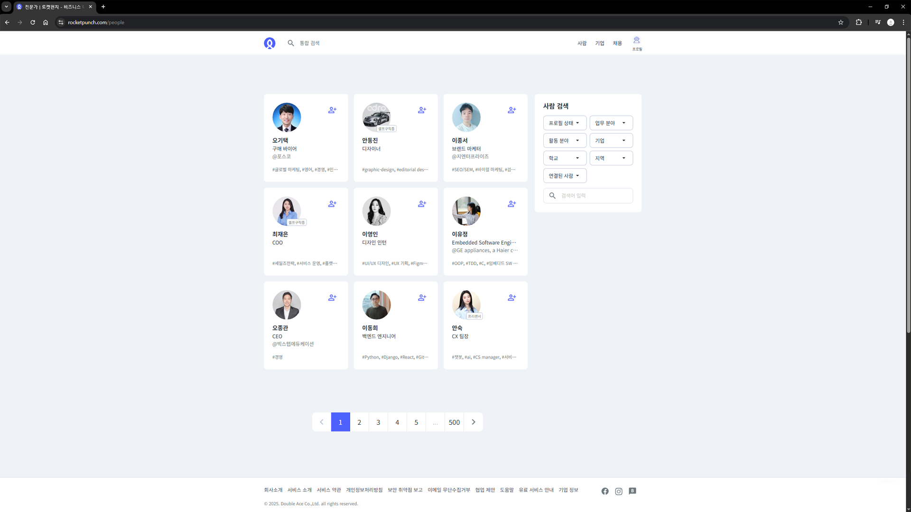
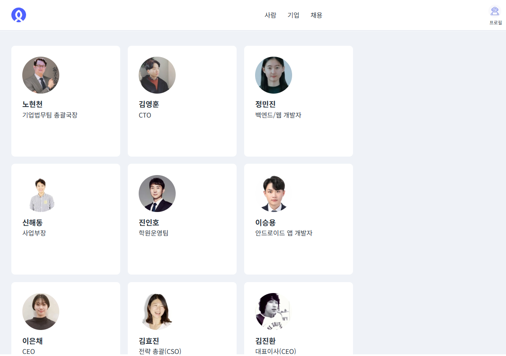
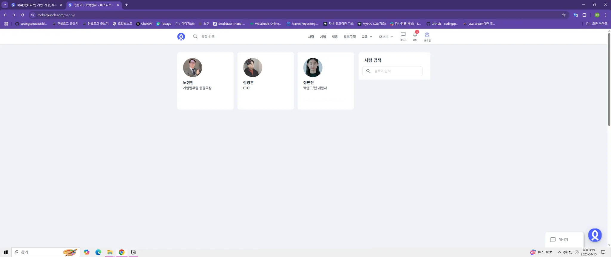
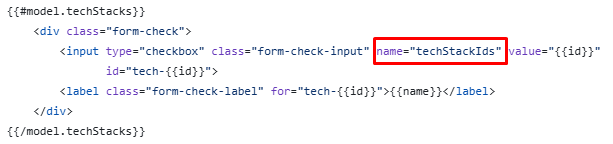
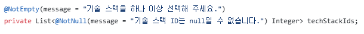

# 구인 구직 플랫폼

<h2>RocketDan</h2>
> 구인구직 플랫폼 ‘로켓펀치’를 모티브로 제작한 개인/기업 대상 이력관리 및 채용공고 관리 플랫폼 입니다.


<br/>

## 프로젝트 시연 영상

<video src="https://github.com/user-attachments/assets/ca07f9b6-24f2-4ab2-bdc5-d84a3115be35" controls width="600"></video>

<br/>

## 목차

1. [🗓️ 개발 기간 및 참여 인원](#개발기간및참여인원)
2. [🔚 회고](#회고)
3. [🗂️ ERD](#erd)
4. [💡 주요 기능](#주요기능)
5. [✍️ 개인 기여도 및 역할](#개인기여도및역할)
6. [👥 팀원](#팀원)
7. [🛠️ 기술 스택](#기술스택)
8. [🧩 문제 해결 경험](#문제해결경험)

<a id="개발기간및참여인원"></a>

## 🗓️ 개발 기간 및 참여 인원

- 기간: 2025.04.11 ~ 2025.04.30
- 인원: 5인 팀 프로젝트

<a id="회고"></a>

## 🔚 회고

### **1️⃣ 협업의 어려움을 느끼다**

**1-1 화면 설계**

모티브를 할 사이트의 이미지를 가져와서 이미지 설계를 하는데 정해진 컨벤션이 없어서 각각의 팀원마다 이미지를 다르게 가져왔다.

[풀사이즈]


[핏사이즈]

가져온 이미지가 한명은 브라우저 풀사이즈로 이미지를 만들어 왔고 다른 한명은 화면에 보여지는 부분만 잘라서 이미지를 만들어 왔다.

나는 만들어진 이미지의 비율이 다르더라도 알아서 잘 만들 수 있을거라고 생각했다. 나중에 선생님에게 피드백을 받을 때 "설계된 이미지가 재각각이면 팀원들이 혼란스러울 수 있다. 통일되게 맞춰라" 라고 하여서 이후
모든 이미지를 풀사이즈로 통일 하였다.

[풀사이즈]


하지만 이 풀사이즈에도 함정이 있었는데 개발에 사용하는 모니터의 비율이 다르면 같은 풀사이즈라도 차이가 있었다. 그래서 팀원들에게 이미지 설계는 동일한 모니터를 사용하는 학원에서 끝내달라고 요청하였다.

**1-2 화면 제작**

화면에서 공통부분으로 사용할 프레임을 만들고 내부의 요소에 각자 만든 html을 넣어달라고 부탁하였다.

[부탁한 내용]

```html
<!-- 헤더 끝 -->

<!-- 껍데기 박스 이 안에 넣어서 코드 작성해 주세요
            삭제하지 말아주세요 -->
<div class="bg-light py-5"></div>

<!-- 푸터 시작 -->
```

[돌아온 결과]

```html
<!-- 헤더 끝 -->

<!-- 껍데기 박스 이 안에 넣어서 코드 작성해 주세요
            삭제하지 말아주세요 -->
<div class="bg-light py-5">
    <html></html>
</div>

<!-- 푸터 시작 -->
----------------------------------------------------

<!-- 헤더 끝 -->

<!-- 껍데기 박스 이 안에 넣어서 코드 작성해 주세요
            삭제하지 말아주세요 -->
<div class="bg-light py-5">
    <style></style>
    <div></div>
</div>

<!-- 푸터 시작 -->
```

명확하게 div 태그로 된 내부 그림만 넣어달라고 부탁하지 않아서 각자 넣어주는 요소가 다른 한명은 html 태그를 통째로 넣은 사람이 있고 누구는 style + div 를 넣어준 사람이 있었다. 그래서 다시 div
내부에 div 로 만든 내부 요소만 넣고 스타일은 위에 추가해 달라고 수정을 부탁하였다. 다음부턴 요구 사항을 좀 더 구체적으로 말해야겠다.

### **2️⃣ 아쉬움을 다음 도전의 동력으로**

이번 프로젝트에서는 역량과 시간 부족으로 인해 검색, 페이징, 이미지 업로드, 알림 등을 적용하지 못하였다. 팀원들의 역량을 제대로 파악하지 못하였고 임무 분담을 적절하게 하지 못하였다고 생각한다. 다음
프로젝트에서는 팀원들의 역량을 잘 파악하고 임무분담을 잘 해야할 것 같다.

<br/>

<a id="erd"></a>

## 🗂️ ERD


<a id="주요기능"></a>

## 💡 주요 기능

### 공통

- 회원가입, 로그인, 로그아웃
- 게시판 - 등록, 수정, 삭제
- 게시판 목록 보기

### 유저

- 이력서 - 등록, 수정, 삭제
- 이력서 목록 보기
- 이력서 상세 보기
- 이력서 지원 하기
- 이력서 지원 내역
- 공고 북마크

### 기업

- 기업 - 등록, 수정, 삭제
- 기업 목록 보기
- 기업 상세 보기
- 채용공고 - 등록, 수정, 삭제
- 채용공고 목록 보기
- 채용공고 상세 보기
- 이력서 지원 받기
- 이력서 지원 응답

<a id="개인기여도및역할"></a>

## ✍️ 개인 기여도 및 역할

| 기능 영역       | 세부 기능        | 기여 내용                                              |
|-------------|--------------|----------------------------------------------------|
| (기업) 공고 정보  | 등록 / 수정      | 공고 정보 Create, Update API 구현 및 응답 DTO 설계            |
| (개인) 이력서 정보 | 보기 / 등록 / 수정 | 이력서 목록 Read, 이력서 Create, Update API 구현 및 응답 DTO 설계 |
| (개인) 공고 지원  | 공고 지원 등록     | 공고 지원 Create API 구현 및 응답 DTO 설계                    |

<a id="팀원"></a>

## 👥 팀원

| 이름  | 역할 | GitHub                                       |
|-----|----|----------------------------------------------|
| 최재원 | 팀장 | [@jjack-1](https://github.com/jjack-1)       |
| 김건우 | 팀원 | [@GUNWO0](https://github.com/GUNWO0)         |
| 김세리 | 팀원 | [@roni243](https://github.com/roni243)       |
| 이연호 | 팀원 | [@yh88888888](https://github.com/yh88888888) |
| 조하은 | 팀원 | [@TaengGyul](https://github.com/TaengGyul)   |

# ⚙️ 기술 스택

## 🛠️ 사용 기술

<table>
    <tr>
        <td align="center"><br/>HTML</td>
        <td align="center"><br/>CSS</td>
        <td align="center"><br/>JavaScript</td>
        <td align="center"><br/>Bootstrap</td>
        <td align="center"><br/>Mustache</td>
        <td align="center"><br/>Java</td>
        <td align="center"><br/>Spring Boot</td>
        <td align="center"><br/>H2</td>
    </tr>
</table>

## 🧰 개발 환경

<table>
    <tr>
        <td align="center"><br/>IntelliJ</td>
    </tr>
</table>

## 🤝 협업 도구

<table>
    <tr>
        <td align="center"><br/>Git</td>
        <td align="center"><br/>GitHub</td>
        <td align="center"><br/>Notion</td>
        <td align="center"><br/>Slack</td>
    </tr>
</table>

<a id="문제해결경험"></a>

## 🧩 문제 해결 경험

### 💬 문제 : 복수의 기술 스택을 선택하고 요청 DTO 에 맵핑하는 방법

- **문제 상황**: input type=”checkbox” 를 사용할 때 1개 이상의 체크박스 선택 시 나머지 체크박스의 value 값을 요청 DTO 에 맵핑한는 방법을 모름. 1개일 때만 가져오는 방법만
  알고 있는 상태
- **해결 방법**:
    - gpt 를 사용해서 찾아봄
    - 같은 name 으로 1개 이상의 value 값이 존재하면 요청 DTO 에서 리스트로 맵핑을 받을 수 있음


