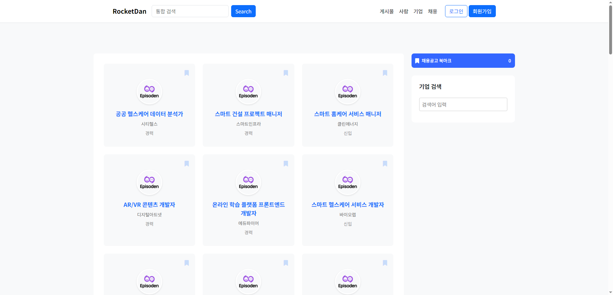
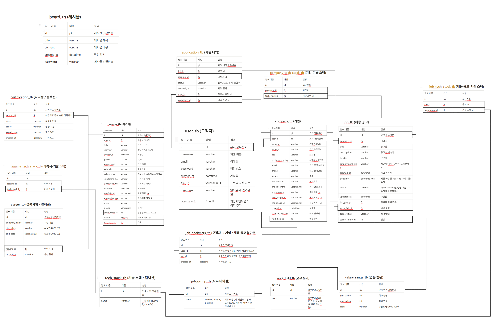

# 휴먼클라우드 웹 - 미니 프로젝트 1 : 1조 - Rocketdan

<br/>

- 자바와 스프링부트, HTML/CSS를 활용한 웹 서버 제작 프로젝트입니다.
- 전체 개발 기간 : 2025. 04. 11 ~ 2025. 04. 30

<br/>



# 👥 팀 멤버

| 이름  | 역할 | GitHub                                       |
|-----|----|----------------------------------------------|
| 최재원 | 팀장 | [@jjack-1](https://github.com/jjack-1)       |
| 김건우 | 팀원 | [@GUNWO0](https://github.com/GUNWO0)         |
| 김세리 | 팀원 | [@roni243](https://github.com/roni243)       |
| 이연호 | 팀원 | [@yh88888888](https://github.com/yh88888888) |
| 조하은 | 팀원 | [@TaengGyul](https://github.com/TaengGyul)   |

# ⚙️ 기술 스택

## 🛠️ 사용 기술

<table>
    <tr>
        <td align="center"><br/>HTML</td>
        <td align="center"><br/>CSS</td>
        <td align="center"><br/>JavaScript</td>
        <td align="center"><br/>Bootstrap</td>
        <td align="center"><br/>Mustache</td>
        <td align="center"><br/>Java</td>
        <td align="center"><br/>Spring Boot</td>
        <td align="center"><br/>H2</td>
    </tr>
</table>


## 🧰 개발 환경

<table>
    <tr>
        <td align="center"><br/>IntelliJ</td>
    </tr>
</table>

## 🤝 협업 도구

<table>
    <tr>
        <td align="center"><br/>Git</td>
        <td align="center"><br/>GitHub</td>
        <td align="center"><br/>Notion</td>
        <td align="center"><br/>Slack</td>
    </tr>
</table>

# 📋 프로젝트 업무 분담

<table style="width: 100%; text-align: start; font-size: 16px; border-collapse: collapse;">
    <thead style="background-color: #f2f2f2;">
        <tr>
            <th style="padding: 10px; border: 1px solid #ddd;">담당자</th>
            <th style="padding: 10px; border: 1px solid #ddd;">프로젝트 업무 분담</th>
        </tr>
    </thead>
    <tbody>
        <tr>
            <td style="padding: 10px; border: 1px solid #ddd;">최재원</td>
            <td style="padding: 10px; border: 1px solid #ddd;">
                <ul>
                    <li>프로젝트 계획 및 관리</li>
                    <li>팀 리딩 및 커뮤니케이션</li>
                    <li>헤더 및 네비게이션 개발</li>
                    <li>이력서 관련 페이지 및 기능 개발</li>
                    <li>채용공고 관련 페이지 및 기능 개발</li>
                </ul>
            </td>
        </tr>
        <tr>
            <td style="padding: 10px; border: 1px solid #ddd;">김건우</td>
            <td style="padding: 10px; border: 1px solid #ddd;">
                <ul>
                    <li>기업 관련 페이지 및 기능 개발</li>
                    <li>채용공고 관련 페이지 및 기능 개발</li>
                    <li>유저의 공고 북마크 기능 개발</li>
                </ul>
            </td>
        </tr>
        <tr>
            <td style="padding: 10px; border: 1px solid #ddd;">김세리</td>
            <td style="padding: 10px; border: 1px solid #ddd;">
                <ul>
                    <li>채용공고 관련 페이지 및 기능 개발</li>
                    <li>게시판 관련 페이지 및 기능 개발</li>
                </ul>
            </td>
        </tr>
        <tr>
            <td style="padding: 10px; border: 1px solid #ddd;">이연호</td>
            <td style="padding: 10px; border: 1px solid #ddd;">
                <ul>
                    <li>로그인 관련 페이지 및 기능 개발</li>
                </ul>
            </td>
        </tr>
        <tr>
            <td style="padding: 10px; border: 1px solid #ddd;">조하은</td>
            <td style="padding: 10px; border: 1px solid #ddd;">
                <ul>
                    <li>이력서 관련 페이지 및 기능 개발</li>
                    <li>더미 데이터 이미지 등록</li>
                </ul>
            </td>
        </tr>
    </tbody>
</table>

# 주요 기능

### 공통
- 회원가입, 로그인
- 게시판 - 등록, 수정, 삭제
- 게시판 목록 보기
- 유효성 검사
- 인증 체크

### 유저
- 이력서 - 등록, 수정, 삭제
- 이력서 목록 보기
- 이력서 상세 보기
- 이력서 지원 하기
- 이력서 지원 내역
- 공고 북마크

### 기업
- 기업 - 등록, 수정, 삭제
- 기업 목록 보기
- 기업 상세 보기
- 채용공고 - 등록, 수정, 삭제
- 채용공고 목록 보기
- 채용공고 상세 보기
- 이력서 지원 받기
- 이력서 지원 응답

# 테이블 구조



# 테이블 생성

### application_tb

```sql
create table application_tb
(
    company_id integer,
    id         integer generated by default as identity,
    job_id     integer,
    resume_id  integer,
    user_id    integer,
    created_at timestamp(6),
    status     varchar(255),
    primary key (id),
    constraint uk_user_company unique (user_id, company_id)
)
```

### board_tb

```sql
create table board_tb
(
    id         integer generated by default as identity,
    created_at timestamp(6),
    content    varchar(255),
    password   varchar(255),
    title      varchar(255),
    primary key (id)
)
```

### career_tb

```sql
create table career_tb
(
    id           integer generated by default as identity,
    resume_id    integer,
    created_at   timestamp(6),
    company_name varchar(255),
    end_date     varchar(255),
    start_date   varchar(255),
    primary key (id)
)
```

### certification_tb

```sql
create table certification_tb
(
    id          integer generated by default as identity,
    resume_id   integer,
    created_at  timestamp(6),
    issued_date varchar(255),
    issuer      varchar(255),
    name        varchar(255),
    primary key (id)
)
```

### company_tb

```sql
create table company_tb
(
    id              integer generated by default as identity,
    user_id         integer unique,
    work_field_id   integer,
    created_at      timestamp(6),
    address         varchar(255),
    business_number varchar(255),
    ceo             varchar(255),
    contact_manager varchar(255),
    email           varchar(255),
    homepage_url    varchar(255),
    info_image_url  varchar(255),
    introduction    text,
    logo_image_url  varchar(255),
    name_en         varchar(255),
    name_kr         varchar(255),
    one_line_intro  varchar(255),
    phone           varchar(255),
    start_date      varchar(255),
    primary key (id)
)
```

### company_tech_stack_tb

```sql
create table company_tech_stack_tb
(
    company_id    integer,
    id            integer generated by default as identity,
    tech_stack_id integer,
    primary key (id)
)
```

### job_bookmark_tb

```sql
create table job_bookmark_tb
(
    id         integer generated by default as identity,
    job_id     integer,
    user_id    integer,
    created_at timestamp(6),
    primary key (id),
    constraint uk_job_user unique (job_id, user_id)
)
```

### job_group_tb

```sql
create table job_group_tb
(
    id   integer generated by default as identity,
    name varchar(255),
    primary key (id)
)
```

### job_tb

```sql
create table job_tb
(
    company_id      integer,
    id              integer generated by default as identity,
    job_group_id    integer,
    salary_range_id integer,
    work_field_id   integer,
    created_at      timestamp(6),
    updated_at      timestamp(6),
    career_level    varchar(255),
    deadline        varchar(255),
    description     text,
    employment_type varchar(255),
    location        varchar(255),
    status          varchar(255),
    title           varchar(255),
    primary key (id)
)
```

### job_tech_stack_tb

```sql
create table job_tech_stack_tb
(
    id            integer generated by default as identity,
    job_id        integer,
    tech_stack_id integer,
    primary key (id)
)
```

### resume_bookmark_tb

```sql
create table resume_bookmark_tb
(
    company_id integer,
    id         integer generated by default as identity,
    resume_id  integer,
    created_at timestamp(6),
    primary key (id),
    constraint uk_resume_company unique (resume_id, company_id)
)
```

### resume_tb

```sql
create table resume_tb
(
    id              integer generated by default as identity,
    is_default      boolean,
    job_group_id    integer,
    salary_range_id integer,
    user_id         integer,
    created_at      timestamp(6),
    birthdate       varchar(255),
    career_level    varchar(255),
    education       varchar(255),
    enrollment_date varchar(255),
    gender          varchar(255),
    graduation_date varchar(255),
    graduation_type varchar(255),
    major           varchar(255),
    phone           varchar(255),
    portfolio_url   varchar(255),
    summary         text,
    title           varchar(255),
    primary key (id)
)
```

### resume_tech_stack_tb

```sql
create table resume_tech_stack_tb
(
    id            integer generated by default as identity,
    resume_id     integer,
    tech_stack_id integer,
    primary key (id)
)
```

### salary_range_tb

```sql
create table salary_range_tb
(
    id         integer generated by default as identity,
    max_salary integer,
    min_salary integer,
    label      varchar(255),
    primary key (id)
)
```

### tech_stack_tb

```sql
create table tech_stack_tb
(
    id   integer generated by default as identity,
    name varchar(255),
    primary key (id)
)
```

### user_tb

```sql
create table user_tb
(
    company_id integer,
    id         integer generated by default as identity,
    created_at timestamp(6),
    email      varchar(255),
    file_url   varchar(255),
    password   varchar(255),
    user_type  varchar(255) not null,
    username   varchar(255) unique,
    primary key (id)
)
```

### work_field_tb

```sql
create table work_field_tb
(
    id   integer generated by default as identity,
    name varchar(255),
    primary key (id)
)
```

# 보완할 점

### 알림

- 기업 - 유저가 지원할 경우 기업에게 알림 기능
- 유저 - 기업이 지원상태를 변경할 경우 유저에게 알림 기능

### 페이징

- 다수의 데이터를 페이지 별로 깔끔하게 만들어 주는 기능

### 검색

- 기업, 공고, 유저를 각각 따로 검색하는 기능
- 기술스택, 주소, 연봉에 따라 검색하는 기능
- 통합 검색 기능

# 느낀점

- 개발 시작할 때 팀원들과 함께 전반적인 프로젝트의 전체적인 진행 방향을 같이 확인해서 협업이 좀더 잘 이루어지게 하고 싶다
- 임무 배정시 좀더 세밀한 임무목록을 작성해서 팀원들이 좀더 신속하게 개발을 할 수 있도록 만들고 싶다
- 회의를 할때 코드리뷰를 같이 하면서 팀원들이 좀더 코드를 잘 만들어서 수정 보완이 잘 될 수 있도록 만들고 싶다 
- 프로젝트의 진행에 대한 설계를 좀 더 잘하고 싶다. 설계를 더 잘하면 프로젝트의 진행 속도가 좀 더 나아질 것 같다
